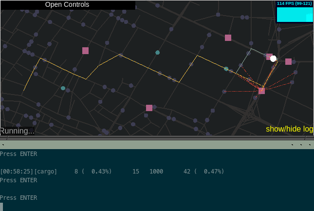

# libcargo (under development)

- *This is the code for the Cargo benchmarking platform and web interface. For
benchmark instances and road networks, visit
[Cargo_benchmark](https://github.com/jamjpan/Cargo_benchmark)*

- *Check out [Getting Started](docs/getting-started.tex) to get up and running
quickly.*

Cargo is a platform for prototyping, evaluating, and visualizing dynamic
ridesharing algorithms. It contains a C++11 static library and a
[nodejs](https://nodejs.org) web interface (`www`).

Ridesharing is a type of vehicle routing problem (VRP). In this problem, the
objective is to route vehicles to serve customers wishing to travel from some
location on a road network to some other location. The key characteristics of
ridesharing are that it is dynamic, meaning that travel requests are appearing
over time, and that it is online, meaning that future requests are not known at
the time routing decisions are made. Current ridesharing companies include
Uber, Lyft, and DiDi.

Cargo aims to let researchers quickly prototype and evaluate ridesharing
algorithms on simulated real-time scenarios instead of on physical customers
and vehicles.  As a result, it provides a rich data model of core ridesharing
concepts (`Vehicle`, `Customer`, `Route`, etc.) and functions.

## Screenshot

Here is an example of an algorithm running in real time against the simulator
inside `tmux`.  (ignore the jumbled text, that is an artifact of terminal
capture).  The top pane shows algorithm output and the bottom shows simulator
output (standard out). Under the hood, special `print` statements within an
algorithm are redirected to a named pipe on the file system that can be
consumed using `cat`.

The algorithm (`example/grabby`) demonstrates a hybrid top-k greedy algorithm
and is implemented in less than 50 lines (not including the copyright at the
top; blank lines; include statements).

## Web Interface

The client for the web interface depends on [THREE.js](https://threejs.org) for
graphics rendering, and the server uses [node.js](https://nodejs.org) and
[socket.io](https://socket.io) for real-time communication with the client.

The server consumes specially-formatted `*.dat` and `*.feed` (named pipe)
files, generated by the Cargo simulator, and sends draw commands to the client
that puts the visuals on its HTML canvas.  Thanks to THREE.js support for GPU
shaders, the client can easily visualize thousands of vehicles (50,000 moving
vehicles at 120 frames per second on my 2016 Lenovo X1 Carbon).

The interface also allows for some interactivity. The `gui` namespace of
`libcargo` provides several functions that users can use to pass drawing
commands to the frontend.  Under the hood, these commands simply print
specially formatted text to standard out. When the web server parses these
texts, it instructs the client to perform the associated drawing command. A
`pause` function can be used to wait on the user before continuing to the next
step of the simulation. These two features are illustrated below. In the user
code, `gui::newroute` is used to draw the yellow route, and `pause` is used to
freeze the real-time running of the simulation and visualization until after
the user presses `Enter` in the server window. The top pane is the browser
and the bottom pane is the separate server window.

## Installation and Usage

See the documentation (`doc`) for installation and usage instructions.

## Roadmap

Ultimately Cargo aims to become a benchmarking tool for ridesharing algorithms.
An application aiming at such a lofty goal as benchmarking should ensure (1) no
algorithm gets any unfair advantage by exploiting some quirk of the tool, and
(2) the benchmark reflects the conditions that an algorithm would encounter in
the real world. The former is accomplished by documenting and verifying exactly
the expected behavior of the library API. The latter can only ever been an
approximation, hence the limitations must be well documented.

Thus on the road map are (1) testing of the API and (2) documentation. Farther
down the line, perhaps (3) new features, such as variable speeds, traffic,
traffic control lights and signs, more accurate streets, ...

## Bugs and Contributing

If you discover a bug, or have a suggestion, please
[Submit an Issue](https://github.com/jamjpan/Cargo/issues/new)!

You can also submit a pull request, against your own branch or against the dev
branch.

## License

Cargo is distributed under the MIT License.

